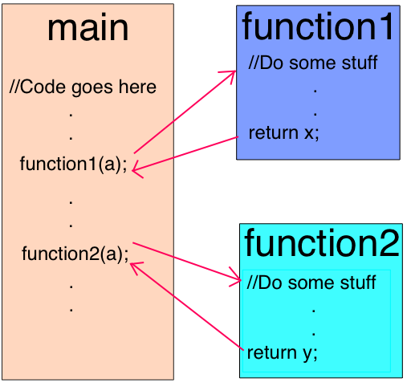

# How Javascript works

### [How JavaScript works: an overview of the engine, the runtime, and the call stack Part - 1](https://blog.sessionstack.com/how-does-javascript-actually-work-part-1-b0bacc073cf)


- Google v8엔진은 크롬이랑 node.js에서 사용중
- v8 엔진은 크게 두가지 컴포넌트 `memory heap`과 `call stack`으로 이루어져 있다.


- `DOM`, `AJAX`, `setTimeout`같은 Web API는 engine에서 제공하는것이 아니고 브라우저에서 제공해준다.
- `callback queue`와 `event loop` 또한 잊으면 안된다.


- `callstack`은 프로그램에 어떤 상태인지 알려주는 자료구조이다.
- 처음엔 비어있지만, 함수를 실행하게 되면 콜 스택에 하나씩 `stack frame`이 쌓이게 된다.
- 각각의 entry는 `stack frame`이라고 한다.

```js
function foo() {
    throw new Error('SessionStack will help you resolve crashes :)');
}

function bar() {
    foo();
}

function start() {
    bar();
}

start();
```

`exception`이 발생하면 `stack trace`가 실행된다.

stack의 한도 이상의 `stack frame`이 쌓이게 되면 `stack overflow`가 발생한다.(maximum call stack size exceeded)

자바스크립트는 싱글 쓰레드로 동작하기 때문에, 특정 작업이 오래걸리게 되면 브라우저에서 렌더링을 할 수 없게 된다. 이에 대한 해결책으로 자바스크립트는 비동기 콜백이라는 방식으로 문제를 해결하게 된다.


### [How JavaScript works: inside the V8 engine + 5 tips on how to write optimized code](https://blog.sessionstack.com/how-javascript-works-inside-the-v8-engine-5-tips-on-how-to-write-optimized-code-ac089e62b12e)

#### Javascript Engine

자바스크립트 엔진은 자바스크립트 코드를 실행하는 프로그램 또는 인터프리터이다. JS Engine은 스탠다드 인터프리터로 구현되거나 자바스크립트를 바이트코드로 바꾸는 just-in-time 컴파일러 형태로 구현할 수도 있다.

구글이 만든 v8 engine은 c++로 구현되어 있으며, 다른 엔진들과 다르게 Node.js runtime에 사용된다.

#### 자바스크립트 엔진이 만들어진 이유

V8은 브라우저내에서 JS 퍼포먼스를 향상시키기 위해서 처음에 만들어졌다. 성능을 향상시키기 위해서는 JS 코드를 interpreter 방식이 아닌 JIT 방식을 사용해서 실행해야 했는데, 다른엔진들과 다르게 V8은 bytecode나 intermeidate code를 생성하지 않는다.

#### V8 used to have two compilers

V8은 두가지 컴파일러를 사용한다.

full-codegen - 간단하고 빠른 컴파일러. 상대적으로 느린 머신코드를 생성
Crankshaft - 좀 더 복잡한 JIT 컴파일러. 상대적으로 빠르고 최적화가 잘 되어 있는 코드를 생성한다

또한 V8은 여러개의 쓰레드를 내부적으로 사용한다.

- 메인쓰레드는 일반적으로 코드를 가져오고, 컴파일하고 실행하는 작업을 수행한다. 
- 컴파일링을 위한 쓰레드가 존재한다. 이 쓰레드는 메인쓰레드가 실행되는 동안 코드를 최적화 한다.
- 몇개의 쓰레드는 가비지 컬렉터를 한다.
- 프로파일러 쓰레드는 어떤 메소드에 코스트가 큰지 분석하고 해당 컴파일러가 해당 메소드를 최적화하도록 런타임에게 알려준다.

자바스크립트가 처음 실행되면 V8은 full-codegen(최적화 x)을 사용해서 빠르게 코드를 실행하게 된다. 이방식을 통해서 V8은 intermeidate byte code를 사용하지 않고도 코드를 실행할 수 있다.

코드를 실행하면 profiler 쓰레드가 최적화에 대한 정보를 수집하게 된다.

다음으로, 다른 쓰레드에서 Crankshaft가 최적화를 수행하게 된다. Crankshaft가 Javascript abstract syntax tree를 hig-level static single-assignemnt로 변환하면서 최적화를 수행하게 된다. 대부분의 최적화가 이 레벨에서 이루어진다.

### Inlining

첫번째 최적화는 inlinng이다. 이때 최대한 많은 코드를 inlining 하려고 노력한다. 인라이닝은 함수가 호출되는 부분을 호출되는 함수의 내용으로 교체하는 작업을 뜻한다.



### Hidden class

자바스크립트는 prototype-based 언어이다. 또한 객체를 만든다음 프로퍼티를 쉽게 추가하고 삭제할 수 있는, 다이나믹 프로그래밍 언어이다.

대부분의 자바스크립트 인터프리터는 해쉬함수 기반의 dicationary-like 구조를 사용해서 객체의 속성값을 메모리에 저장한다. 이러한 구조에서는, 객체의 속성에 접근하는 연산이 자바나 시샾같은 non-dynamic programming language에 비해서 코스트가 크다. 자바에서는 모든 오브젝트의 레이아웃이 컴파일 전에 고정되어 있기 때문에, 런타임에 동적으로 속성을 추가하거나 제거할 수 없다. 따라서 모든 속성의 값(혹은 포인터가) 모두 메모리안에 있는 continuous-buffer에 고정된 offset을 가지고 저장된다. 각각의 offset길이는 속성의 type따라서 쉽게 계산된다. 속성의 타입이 런타임에도 바뀔수 있는 자바스크립트에서는 이러한 방식이 불가능하다.

dictionary 구조를 사용해서 메모리에서 값을 찾는건 매우 비효율적이기 때문에 V8은 hidden classes를 사용한다. hidden classes는 자바의 클래스와 매우 비슷하지만 런타임에 실행된다는 점이 다르다.

```js
function Point(x, y) {
    this.x = x;
    this.y = y;
}
var p1 = new Point(1, 2);
```

`new Point(1,2)` 코드가 수행되면, V8은 `C0`이라는 hidden class를 새롭게 만들게 된다. 이때 어떠한 속성도 없는 상태이기 때문에 `C0`은 비어있는 상태이다. `this.x = x`이 실행되면, `C0`을 기반으로 한 V8은 두번째 hidden class인 `C1`을 만든다. `C1`에서는 x의 프로퍼티의 offset이 저장되어 있다. 이때 x의 offset은 0이 된다. V8은 `C0`을 class transition을 통해서 업데이트 한다. 이때 hidden class point object는 `C1`을 가르키게 된다. 


Every time a new property is added to an object, the old hidden class is updated with a transition path to the new hidden class. Hidden class transitions are important because they allow hidden classes to be shared among objects that are created the same way. If two objects share a hidden class and the same property is added to both of them, transitions will ensure that both objects receive the same new hidden class and all the optimized code that comes with it.


이 프로세는 `this.y = y`가 실행될때도 반복된다. `C2`라는 hidden class가 만들어지고 y는 x와 다른 offset을 가진다. 히든 클래스의 오브젝트는 `C2`를 가르킨다. hidden class transition은 프로퍼티가 오브젝트에 추가되는 순서에 영향을 받기 때문에 다이나믹하게 오브젝트를 생성할 경우 이러한 순서를 일정하게 하는 것이 최적화에 도움이 된다.

```js
function Point(x, y) {
    this.x = x;
    this.y = y;
}
var p1 = new Point(1, 2);
p1.a = 5;
p1.b = 6;
var p2 = new Point(3, 4);
p2.b = 7;
p2.a = 8;
```

p1과 p2는 다른 transition path를 가지게 된다.

### Inline caching

V8이 사용하는 최적화 방식. 같은 타입의 오브젝트가 반복되서 호출되는 것을 관찰하는 것에서부터 시작된다. 더 알아보고 싶다면 [여기](https://github.com/sq/JSIL/wiki/Optimizing-dynamic-JavaScript-with-inline-caches)를 참조하자. 이 포스트에서는 전반적인 컨셉만 설명하도록 하겠다.


### Compilation to machine code

`Hydrogen graph`가 최적화 된다면, `Crankshaft`는 이 것을 `Lithium`이라 불리는 로우레벨 표현으로 나타낸다. 대부분의 `Lithium` 구현은 architecture-specific이다. Register allocation은 대부분 이 레벨에서 일어난다. 

마지막으로 `Lithium`은 머신코드로 컴파일 된다. 그리고 OSR이라 불리는 일이 발생한다. 오래 실행되는 메소드를 컴파일하고 최적화하기 전에, 우리가 그 메소드를 실행할 수도 있다. V8 is not going to forget what it just slowly executed to start again with the optimized version. 대신 V8은 우리가 가지고 있는 모든 컨텍스트(stack registers)를 transfrom해서 우리가 optimized 된 버젼으로 실행 도중 변환 할 수 있게 해준다. This is a very complex task, having in mind that among other optimizations, V8 has inlined the code initially. V8 is not the only engine capable of doing it.

deoptimization이라고 불리는 안전망이 있다. transformation의 반대로써 엔진이 만드는 가정이 더이상 옳지 않다고 판단되면  none-optimized 코드로 다시 돌아갈 수 있는 기능이다.
There are safeguards called deoptimization to make the opposite transformation and reverts back to the non-optimized code in case an assumption the engine made doesn’t hold true anymore.

### Garbage collection

V8은 전통적인 `mark-and-swap` 방식을 사용한다. 마킹 페이즈에서는 자바스크립트 실행을 멈추게 된다. GC 비용을 조절하고, 좀 더 나은 실행환경을 만들기 위해서 V8은 `incremental marking`을 사용한다. 전체 힙을 순회(`heap walk`)하는것이 아니라, 일부 가능한 오브젝트를 표시하고 다시 스크립트를 실행한다. 다음 GC는 저번(`heap walk`)가 끝난 부분에서 다시 수행된다. 이 방법을 사용하면 실행도중 `pause`되는 시간을 줄일 수 있다. `sweep phase`는 또 다른 쓰레드에서 수행된다.

### Ignition and TurboFan

V8이 2017년도에 새롭게 도입한 실행 파이프라인이 메모리 절약과 퍼포먼스에 엄청나게 향상시켰다. 이 실행 파이프라인은 V8 인터프리터(`Ignition`)과 V8 컴파일러(`TurboFan`)에 의거해서 만들어졌다.

https://v8project.blogspot.kr/2017/05/launching-ignition-and-turbofan.html

5.9 version의 V8부터 `full-codegen`과 `Crankshaft`는 자바스크립트 실행에 더이상 사용되지 않는다. 


### How to write optimized JavaScript

1. **Order of object properties**
    - hidden class를 공유될 수 있도록 작성해야한다.
2. **Dynamic properties**
    - 동적으로 속성을 추가하게 되면 hidden class transition을 강제하기 때문에, 최대한 생성자에서 모든 속성을 추가하는 것이 좋다.
3. **Methods**
    - 인라인 캐싱이 적용되기 때문에 같은 오브젝트에서 반복적으로 실행되는 메쏘드는 좀 더 빠르다.

4. **Array** **Object**
    - 키값이 sparese하게 증가되는 어레이는 사용하지 않는게 좋다. 이러한 배열은 해쉬테이블과 다를게 없고 그러한 배열의 접근하는 연산은 비싸다
    - 큰 배열을 미리 allocation 하는 것을 피한다
4. **Tagged values** 
    - V8은 오브젝트와 number를 32비트로 나타낸다.
    - V8은 1비트를 SMI인지 아닌지를 확인하기 위한 flag로 사용한다. 만약 SMI가 아닐경우 V8은 해당 넘버를 box화해서 해당 number를 double로 만들거나 new object를 만들어서 넣게 된다. 따라서 31 signed 넘버를 최대한 사용하는 것이 좋다